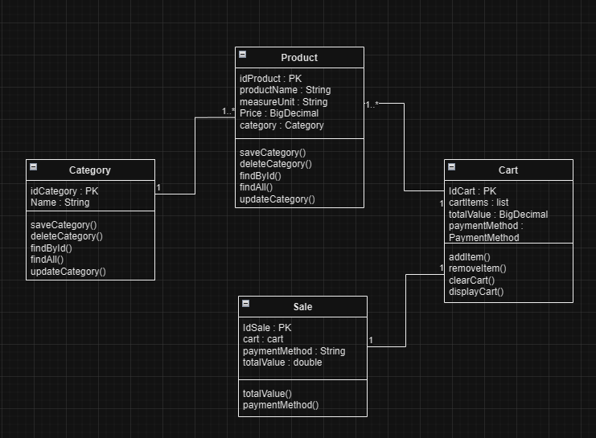

#  Jumarket - Autoatendimento
Este é o projeto do sistema de autoatendimento para a mercearia Jumarket, localizada no bairro Bom Descanso. 
Este projeto foi desenvolvido como um desafio pós bootcamp da TQI.  
O sistema permite que os clientes façam suas compras de forma autônoma, selecionando os produtos desejados e finalizando a compra por conta própria.

## Tecnologias Utilizadas
Linguagem de Programação: Kotlin  
Gerenciador de Dependências: Gradle  
Framework: Spring Boot

## Diagrama UML de funcionamento

## Funcionalidades

### Cadastro de Categorias

O cadastro de categorias permite adicionar novas categorias de produtos à base de dados. Cada categoria é identificada pelo seu nome.
### Cadastro de Produtos

Nesta funcionalidade, é possível cadastrar os produtos disponíveis no mercado. Cada produto possui as seguintes informações:  
Nome: Identificação única do produto.  
Unidade de Medida: Indicação da unidade utilizada para medir o produto (ex: kg, unidade, litro).  
Preço Unitário: Valor do produto por unidade de medida.

### Carrinho de Compras

O carrinho de compras permite que os usuários selecionem os produtos que desejam adquirir.Cada item do carrinho possui as seguintes informações:  
Produto: Identificação única do produto selecionado.  
Quantidade de Itens: Número de unidades do produto selecionado.  
Preço: Valor total do produto com base na quantidade selecionada.  

### Venda

A venda permite que o usuário calcule o valor total do carrinho e selecione o método de pagamento, desta forma finalizando a compra.

## Considerações

Este projeto foi de muito aprendizado e realizado com muito esforço. Até então não foi possível implementar todas as funções que gostaria mas assim que possível planejo incrementar e aplicar todo o meu potencial no projeto.

